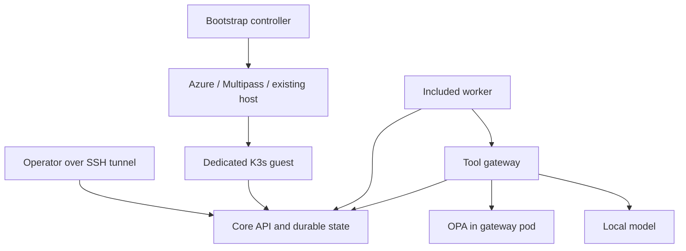

# Nomiarch

Private AI and infrastructure automation designed for air-gapped and cloud environments.

**Current build: `0.1.0.dev1` — an engineering preview of the bootstrap and portable core.**
This repository contains executable software and deployment recipes. Ubuntu guest installation,
repair, upgrade, and encrypted recovery of application state have passed integration testing.
Actual Azure provisioning, local hypervisor combinations, and disconnected clean-host restore
remain release gates. See [validation status](docs/validation.md).

## Try it locally first

Requires Python 3.11+ on macOS/Linux, or Linux in WSL2. No Python packages, Docker,
Azure account, or cloud resources are needed for this first test.

```bash
git clone https://github.com/Nomiarch/nomiarch.git
cd nomiarch
python3 -m nomiarch dev demo
```

The demo starts three separate local processes, submits configuration for inspection,
records the findings, checks authentication, and confirms that `foundation.destroy` is denied.
State and the report are retained under `.nomiarch/dev/`. This quick test uses a clearly
labelled **deterministic development adapter**; it does not claim to run a model or create an air gap.
The same test can use a real local model with `--model-url http://127.0.0.1:8080`.

**[Full local and Azure test guide →](docs/testing.md)**

## What this build implements

| Component | Behavior |
| --- | --- |
| Bootstrap CLI | Interactive configuration, planning, provisioning, installation, repair, core upgrades, backup, status, and scoped destruction |
| Local provider | Creates a uniquely named Multipass VM from an admitted Ubuntu 24.04 image |
| Existing host provider | Installs on a dedicated Ubuntu 24.04 host through trusted SSH; cannot destroy the host |
| Azure provider | OpenTofu recipe for a private VM, NSG, persistent disk, and new or adopted network attachment |
| Release bundle | Checksummed K3s, runtime images, OPA, model, installer, and age; RSA signature verified before payload execution |
| Portable core | Authenticated API, SQLite task queue, leased execution, idempotent submission, and a chained audit log |
| Included worker | Checks submitted configuration and obtains an explanation from a local llama.cpp model; no arbitrary shell or infrastructure writes |
| Tool gateway | Separate service and identity; OPA authorization and durable evidence required before tool execution |
| Recovery | Consistent SQLite snapshot, service identities, and active release in an encrypted ZIP; protected restore into a new destination |
| Temporary tests | Optional destroy-after on success/failure/cancellation; retained reports; separate cleanup result; expiry worker for an independent controller |

The bootstrap owns its Azure credentials and IaC state. Core, worker, gateway, policy,
and inference have separate roles and run together on one guest. They do not need a
cloud control plane or hosted inference service to operate.

## Azure test with cleanup

After preparing the configuration as described in the [guide](docs/testing.md#azure), run:

```bash
python3 -m nomiarch bootstrap plan -f env.azure.json --provider-plan
python3 -m nomiarch bootstrap apply -f env.azure.json --scope foundation --destroy-after
```

The first command creates **no Azure resources**. The second actually provisions and checks
the VM, then deletes the specifically owned test resource group and waits for deletion.
**Azure usage before deletion can still be billed.** A successful cleanup does not turn a failed
installation test into a pass. Keep the initiating controller alive for attended tests; an
independent expiry worker is required for `--unattended` tests.

## Architecture and boundaries



An ordinary Azure installation is a **restricted private cloud workload**, with Azure platform
dependencies. A local VM on a connected workstation is also not a physical air gap. The
isolated on-premises profile depends on the site's host, administration network, trust,
time, and controlled-transfer arrangements. These boundaries must be tested; they are not
established by an installation success message.

The initial installer uses K3s's documented offline image import path directly. Zarf remains
an integration candidate; there is no untested wrapper pretending to provide Zarf behavior.
Application upgrades currently stay on the admitted K3s version and database schema.

## Repository map

| Path | Purpose |
| --- | --- |
| `nomiarch/bootstrap/` | Privileged controller, provider adapters, bundle verification, guest lifecycle, recovery |
| `nomiarch/core/` | Core API, private workflow database, and audit |
| `nomiarch/runtime/` | Worker and tool gateway |
| `infra/azure/` | Pinned AzureRM recipe and provider lock |
| `packages/` | Container build and admitted dependency inventory |
| `policies/` | Rego policy and policy tests |
| `tests/` | Behavioral, security-boundary, lifecycle, and artifact/recovery tests |
| `docs/` | Test instructions, architecture decisions, and release gates |

Model weights, image archives, environment credentials, state, backups, and signing keys
are deliberately kept out of Git. Review upstream licenses and notices before distributing
a release bundle. No stable release or production security claim is made by this preview.
